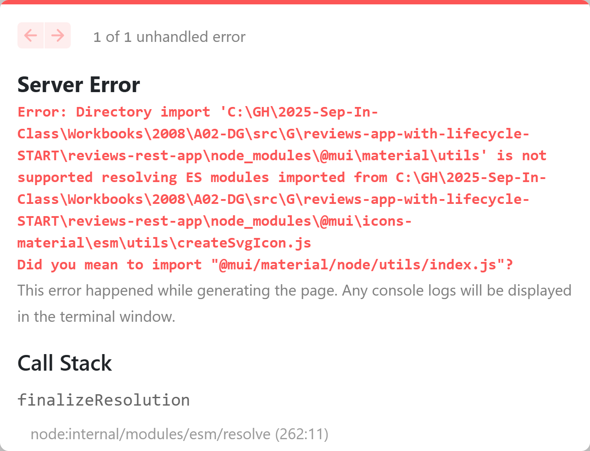

# Starter Kits

The following starter kits are for in-class and/or practice work in DMIT-2008. They are arranged according to the main topics in the Brightspace course materials.

## React Components and LifeCycle

> Read about [`useEffect()`](./useEffect.md).

- [App with Lifecycle](./reviews-app-with-lifecycle-START/README.md)
  - In this demo, we're being asked to also add in the `@mui/icons-material` dependency, but attempting to do so will cause a problem because of **conflicts**. Specifically, we can get a "Directory Import" error. And the actual cause is due to not having **compatible Material UI libraries** installed.
  
    

  - The fix was to remove and then re-add that dependency with the correct verion: `npm install @mui/icons-material@5.10.2`
- [~~Mounting Fundamentals~~](./react-mounting-fundamentals-START/README.md) - TO BE REPLACED...
